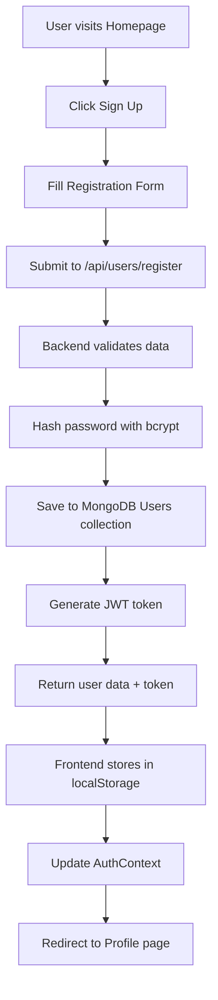
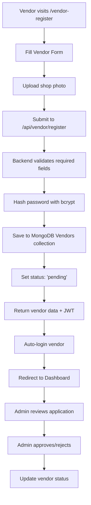
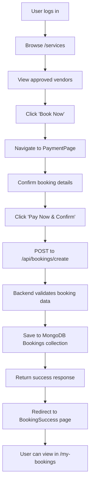
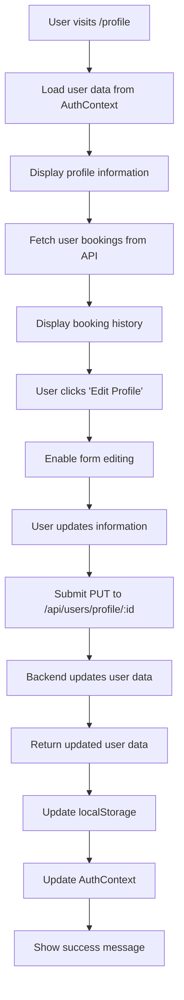
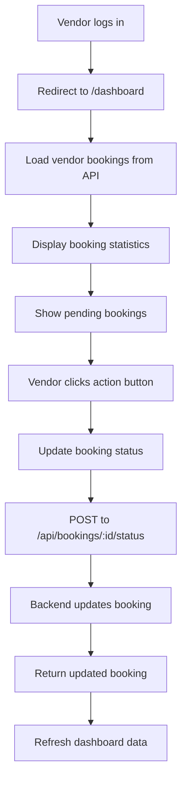
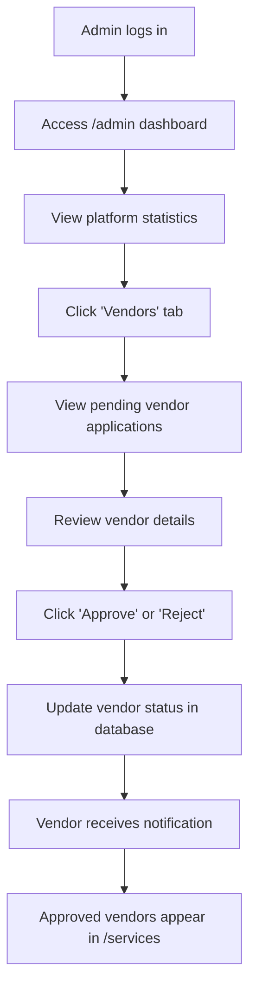

# 🏠 HomeCare Service Booking Platform - Complete Process Flow

## 📋 **Application Architecture Overview**

### **Frontend (React)**
- **Authentication**: Context-based state management
- **Routing**: React Router DOM for navigation
- **UI**: Tailwind CSS for styling
- **API**: Axios for HTTP requests

### **Backend (Node.js + Express)**
- **Database**: MongoDB with Mongoose ODM
- **Authentication**: JWT tokens
- **File Upload**: Multer middleware
- **Security**: bcrypt for password hashing

---

## 🔄 **Complete User Journey Process Flow**

### **1. User Registration & Authentication Flow**



**Key Files:**
- **Frontend**: `client/src/pages/SignUp.jsx`
- **Backend**: `server/controller/userController.js` → `registerUser`
- **Database**: `server/models/User.js`

---

### **2. Vendor Registration & Approval Flow**



**Key Files:**
- **Frontend**: `client/src/pages/vendorRegister.jsx`
- **Backend**: `server/controller/vendorController.js` → `registerVendor`
- **Database**: `server/models/Vendor.js`

---

### **3. Service Booking Flow**



**Key Files:**
- **Frontend**: `client/src/pages/Services.jsx`, `client/src/pages/paymentPage.jsx`
- **Backend**: `server/controller/bookingController.js` → `createBooking`
- **Database**: `server/models/booking.js`

---

### **4. Profile Management Flow**



**Key Files:**
- **Frontend**: `client/src/pages/Profile.jsx`
- **Backend**: `server/routes/User.js` → profile update route
- **Context**: `client/src/context/authContext.jsx`

---

### **5. Vendor Dashboard Flow**



**Key Files:**
- **Frontend**: `client/src/pages/Dashboard.jsx`
- **Backend**: `server/controller/bookingController.js` → `updateBookingStatus`

---

### **6. Admin Management Flow**



**Key Files:**
- **Frontend**: `client/src/pages/AdminDashboard.jsx`, `client/src/pages/AdminVendors.jsx`
- **Backend**: `server/routes/admin.js`

---

## 🗄️ **Database Schema & Relationships**

### **Users Collection**
```javascript
{
  _id: ObjectId,
  name: String,
  email: String (unique),
  password: String (hashed),
  phone: String,
  address: String,
  role: String (default: "user"),
  createdAt: Date,
  updatedAt: Date
}
```

### **Vendors Collection**
```javascript
{
  _id: ObjectId,
  name: String,
  email: String (unique),
  password: String (hashed),
  shopName: String,
  service: String,
  contact: String,
  location: String,
  photo: String (filename),
  status: String (pending/approved),
  createdAt: Date,
  updatedAt: Date
}
```

### **Bookings Collection**
```javascript
{
  _id: ObjectId,
  user: ObjectId (ref: Users),
  shop: ObjectId (ref: Vendors),
  service: String,
  date: Date,
  time: String,
  amount: Number,
  status: String (pending/confirmed/completed/cancelled),
  createdAt: Date,
  updatedAt: Date
}
```

---

## 🔐 **Authentication & Security Flow**

### **JWT Token Management**
1. **Login**: Generate JWT with user ID and role
2. **Storage**: Store in localStorage (client) + httpOnly cookie (server)
3. **Validation**: Middleware checks token on protected routes
4. **Refresh**: Token expires after 7 days, user must re-login

### **Password Security**
1. **Registration**: Hash password with bcrypt (salt rounds: 12)
2. **Login**: Compare hashed password with input
3. **No plain text**: Passwords never stored in plain text

### **Route Protection**
- **Public Routes**: Home, Login, SignUp, Services
- **User Routes**: Profile, MyBookings (requires user token)
- **Vendor Routes**: Dashboard (requires vendor token)
- **Admin Routes**: AdminDashboard, AdminVendors (requires admin token)

---

## 📡 **API Endpoints & Data Flow**

### **Authentication APIs**
```
POST /api/users/register     → Create new user account
POST /api/users/login        → Authenticate user/vendor
PUT  /api/users/profile/:id  → Update user profile
GET  /api/users              → Get all users (admin)
```

### **Vendor APIs**
```
POST /api/vendor/register    → Create new vendor account
GET  /api/vendor            → Get all approved vendors
PUT  /api/admin/vendors/:id/approve → Approve vendor (admin)
PUT  /api/admin/vendors/:id/reject  → Reject vendor (admin)
```

### **Booking APIs**
```
POST /api/bookings/create           → Create new booking
GET  /api/bookings/user/:userId     → Get user's bookings
GET  /api/bookings/vendor/:vendorId → Get vendor's bookings
PUT  /api/bookings/:id/status       → Update booking status
```

---

## 🎨 **UI/UX Flow & Navigation**

### **Navigation Structure**
```
HomePage (/)
├── Services (/services)
├── About (/about)
├── Contact (/contact)
├── Login (/login)
├── SignUp (/signup)
├── VendorRegister (/vendor-register)
└── AdminLogin (/admin-login)

Authenticated Routes:
├── Profile (/profile)
├── MyBookings (/my-bookings)
├── PaymentPage (/payment)
├── BookingSuccess (/payment-success)
├── Dashboard (/dashboard) - Vendor
└── AdminDashboard (/admin) - Admin
    ├── AdminVendors (/admin/vendors)
    ├── AdminUsers (/admin/users)
    └── AdminQueries (/admin/queries)
```

### **State Management Flow**
1. **AuthContext**: Global authentication state
2. **localStorage**: Persistent user data and tokens
3. **Component State**: Local UI state management
4. **API State**: Loading, error, and success states

---

## 🔧 **Error Handling & Validation**

### **Frontend Validation**
- **Form Validation**: Required fields, email format, password strength
- **API Error Handling**: Display user-friendly error messages
- **Loading States**: Show spinners during API calls
- **Fallback UI**: Handle empty states and errors gracefully

### **Backend Validation**
- **Input Validation**: Check required fields and data types
- **Database Validation**: Mongoose schema validation
- **Error Responses**: Consistent error message format
- **Logging**: Console logs for debugging

---

## 🚀 **Deployment & Testing Flow**

### **Local Development**
1. **Backend**: `npm run dev` (nodemon)
2. **Frontend**: `npm run dev` (Vite)
3. **Database**: MongoDB local or Atlas
4. **Testing**: Manual testing of all flows

### **Production Deployment**
1. **Backend**: Deploy to Vercel/Railway/Heroku
2. **Frontend**: Deploy to Vercel/Netlify
3. **Database**: MongoDB Atlas
4. **Environment**: Set production environment variables

---

## 📊 **Data Flow Summary**

### **Complete Booking Process**
1. **User Registration** → JWT Token → Profile Access
2. **Vendor Registration** → Admin Approval → Service Listing
3. **Service Discovery** → Booking Creation → Payment Confirmation
4. **Booking Management** → Status Updates → Completion

### **Key Integration Points**
- **AuthContext ↔ API**: Token-based authentication
- **Frontend ↔ Backend**: RESTful API communication
- **Database ↔ Controllers**: Mongoose ODM operations
- **File Upload ↔ Storage**: Multer middleware handling

---

## ✅ **Testing Checklist**

### **User Flow Testing**
- [ ] User registration and login
- [ ] Profile creation and editing
- [ ] Service browsing and booking
- [ ] Payment confirmation
- [ ] Booking history viewing

### **Vendor Flow Testing**
- [ ] Vendor registration
- [ ] Admin approval process
- [ ] Dashboard access and management
- [ ] Booking status updates

### **Admin Flow Testing**
- [ ] Admin login and dashboard
- [ ] Vendor approval/rejection
- [ ] User management
- [ ] Platform statistics

### **Technical Testing**
- [ ] API endpoint functionality
- [ ] Database operations
- [ ] File upload handling
- [ ] Error handling and validation
- [ ] Responsive design
- [ ] Cross-browser compatibility

---

**🎯 This comprehensive flow ensures a complete, functional HomeCare service booking platform with proper authentication, role-based access, and seamless user experience.**
